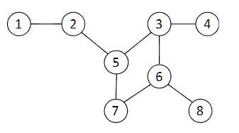

# 2022 Computing with the Cloud Exam

## Question 1

1. You and your friends decide to create a new web application, called StudyTogether, that will allow students to form online peer study groups. Your first prototype will allow you to write custom notes on library books, and chat with other students to discuss the materials.

You partner with the University of Kent, that will allow you access to the Templeman library, and the University of Kent IT Account authentication system. Your first challenge is to integrate these systems. To understand better where you stand, you start by sketching the architecture of the existing systems, and what you plan for your own.

From initial conversations, this is what you know:

- The systems of the Templeman library, and the University of Kent IT Account authentication system are hosted by the University of Kent’s own Cornwallis Data Centre.
- The systems run on hardware shared with other services provided by the university.
- The Templeman library system is written in Java and runs on top of a docker container.
- You do not know much about the authentication system, except that it runs on the Cornwallis Data Centre, and that it runs on top of Linux.
- You chose a Function-as-a-Service architecture for your system, which you will deploy using IBM Cloud Functions. The first prototype will provide four functions: (1) login, which will use your Kent IT Account; (2) annotate book; (3) view book annotations; and (4) write message to a module group chat.

> a. Draw a diagram with the cloud software stacks of the described system. Be as specific as possible, based on the details provided. Make sensible assumptions for elements omitted.

[Insert Image]

> b. On the diagram for point (a), indicate the likely Type of Cloud Service and Type of Cloud for each stack.

[Insert answer]

> c. To view the notes of a page, the following steps will happen: (1) the web client will call the “view book notes” function; (2) the function will retrieve a book page via the Templeman library; (3) the function will add the notes to the page and send it back to the web client. Describe briefly the most important factors that will affect the performance of the “view book notes” function. (Hint: you can write a basic equation, or performance model, to help your explanation).

[Insert answer]

## Question 2

> a. In the context of Packet Switching, what is a packet? How are packets transmitted? Describe some of the consequences of using packet switching?

In packet switching, a packet is a unit of data that contains the information being transmitted, as well as control information for routing and error checking. Packets are then transmitted across the network in small chunk, perhaps taking different routes to get to the same destination. Some of the consequences of packet switching is that provide an efficient use of network resources, by allowing multiple packets to share the same communication channels. In addition, if a route within the network goes down, the data is able to take additional routes

> b. The Open Systems Interconnection (OSI) Protocol Model describes seven protocol layers: Application, Presentation, Session, Transport, Network, Data Link, and Physical. Describe briefly what are the responsibilities of the Network layer. Give an example of Network layer protocol and explain its main characteristics.

The Network layer, also known as Layer 3 in the OSI model, is responsible for facilitating communication and routing of data packets between different networks.

An example of a Network layer protocol is the Internet Protocol (IP). IP is a connectionless, best-effort protocol that provides logical addressing and packet routing in the Internet.

> c. Suppose that web server A sends a hypertext document to a web browser in machine B. Describe briefly what happens at each protocol layer. What does encapsulation mean in the context of network protocols?

- At the application layer, the web browser sends an HTTP request to retrieve the requested document.
- The presentation deals with formatting the data so that it is readable by other systems.
- The session layer adds syncronisation data to make sure that the two machines are to communicate together
- At the transport layer, the hypertext document is encapulated into TCP segments, which helps to establish a connection between the web server and the web browser to ensure the reliable delivery of data.
- At the network layer, the TCP segments are encapulated into IP packets by adding source and destination IP addresses. IP determines the route the packets will take to reach machine B.
- The data link layer encapulates the IP packages into data frames, which includes MAC addresses, to allow for the data to be sent to the specific machines within the network segment. Prepares for the transmission between physical mediums
- The physical layer converts the data to electrical signals or optical signals to allow for transmission over the physical medium (e.g. fiber optics, copper wires, etc).

Encapsulation in the context of network protocols refers to adding headers and additional data at each protocol layer as the information moves down the protocol stack.

> d. Two well-known protocols at the Transport layer are the Transmission Control Protocol (TCP), and the User Datagram Protocol (UDP). Explain their key features and differences.

TCP ensures reliable, in-order delivery of data, to send data. It is connection-oriented, and relies on establishing a connection between the sender and receiver. It guarantees that the data arrives in the correct order, manages the data flow to prevent DDOS and other types of attacks, and even if some data is lost during transmission, TCP ensures that all the data arrives.

UDP on the other hand is connectionless, meaning that a connection isn't established before transmission. In addition, UDP doesn't guarantee the delivery of all data, compared to TCP, meaning that there is a risk of data loss, duplication, or out-of-order delivery. UDP offers a more lightweight communication, and can be used for services such as livestreaming and online gaming.

[insert answer]

## Question 3

### a. This question part is about parallelisation. Suppose the execution of a video rendering job using 2 VM on an IaaS cloud takes 6 hours for a total cost of £4. The job is composed of rendering 100 short videos. Consider what would happen if 4 VMs are used to execute the same job. Answer the following questions (state any assumption you make as part of the answers)

> (i) Say if the total cost and the time to complete the job would stay the same, reduce, or increase and by how much. Justify your answer.

It's more expensive

Assuming the cost of VM usage is directly proportional to the time it takes to complete the job, the total cost would likely increase. This would be because you would be using more servers to do the same job. In this framework, you would be processing videos faster, because a single video is being processed using four VMs, at the cost of higher prices.

> (ii) Now consider the case of a rendering job with the same characteristics (6 hours, 2 VMs cost of £4) but is instead composed of rendering 2 long videos. What would happen to the time and total cost if 4 VMs are used to run the job? Justify your answers.

It would be the same price for processing the videos, but it may be a higher price overall given the fact that you now have access to four VM instead of just two, depending on the pricing model that the IaaS company has provided for you. This is because the two long videos would still only be rendered using two VMs, and the other two VMs would be idle, therefore costing nothing. It would take the same amount of time as if you had access to only two VMs, as you'll only have two VMs actively working.

### b. This question part is about distributed algorithms. Consider the execution of the distributed Breadth First Search (BFS) algorithm on the following graph, considering node 5 as the leader. Answer the following questions

> i: Which nodes (if any) do receive more than one accept message over the run of the algorithm? Justify your answer.

Analyzing the given network with node 5 as the leader for the distributed Breadth First Search (BFS) algorithm, the BFS tree construction would proceed as follows:

Node 5 (leader) initiates the BFS by sending accept messages to its neighbors 2, 3, and 7:

- Nodes 2, 3, and 7 receive one accept message each from node 5.
- Node 2 sends an accept message to its neighbor 1.
- Node 3 sends an accept message to its neighbors 4 and 6.
- Node 7 sends an accept message to its neighbor 6.
- Nodes 1, 4, and 6 receive one accept message each from their respective parent nodes.
- Node 6 receives an accept message from both node 3 and node 7.

Therefore, node 6 is the only node that receives more than one accept message over the run of the distributed BFS algorithm. This is because node 6 is a common neighbor of both node 3 and node 7, and it will receive an accept message from each of them during the BFS tree construction.

> ii: How many time steps does it take for the algorithm to terminate? Justify your answer.

[insert image]
