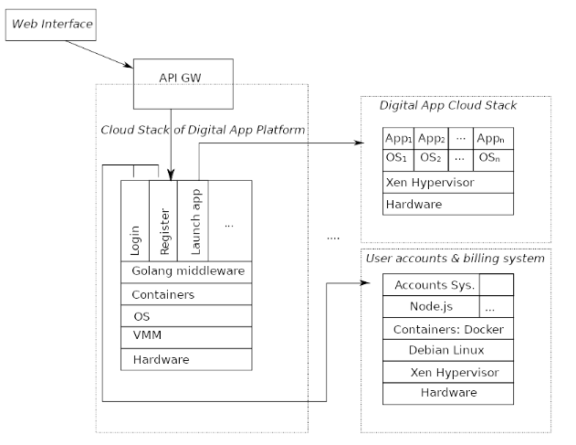
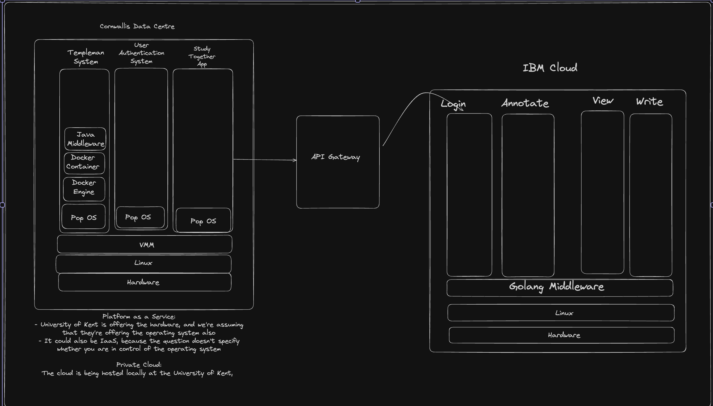

# 2023 Computing with the Cloud Exam

## Question 1

1. You start working as a software developer for a company that develops,
maintains, and manages an online platform that provides interactive digital
applications (e.g. online collaborative editors, educational tools, online games,
etc). To understand the architecture of their systems, you are provided with the
following diagram:

In this diagram, you can observe three different cloud stacks: (1) the digital app platform; (2) the cloud system that hosts digital applications; and (3) the user
accounts and billing system. The cloud system (1) provides services to the user
via a web interface. The cloud system (2) hosts arbitrary applications that can
be launched on demand by the user. The cloud system (3) manages user
accounts. As far as you understand, the digital app platform (1) is hosted by a
well-known cloud provider; the digital applications (2) are developed and hosted
by a different partner company; and (3) the accounts and billing system is
hosted and maintained in a shared infrastructure, together with the partner
company.

> a. Given this information, and the elements in the diagram, what are the likely types of clouds (public, private, hybrid, community, ...), and types of cloud services (PaaS, IaaS, SaaS, FaaS) used by the different cloud stack diagrams? Justify your answers

Cloud stack of Digital App Platform:

- Public cloud
- SaaS

Digital App Cloud Stack:

- Community cloud
- PaaS

User accounts and billing system:

- Community cloud
- IaaS

> b. Explain what are the benefits and the drawbacks of the type of cloudservice chosen for the digital app platform

We don't have to host the infrastructure ourselves, therefore we are able to save money. As well, it is much easier to scale your application quickly using a cloud provider.

The major drawback is that we have much less control over infrastructure and data.

> c. The arrows in the diagram represent communication. For each of the arrows in the diagram, explain a possible reason for such communication

The arrow between the web interface and the API gateway to allow for a bridge of connection between the client/web interface and the underlying services being provided.

The API gateway connects to the application, which includes logic, register, launch app, etc.

If the request of the user is to launch an app, the request will get routed to the digital app cloud stack, where the API will guide the resquest to the correct part of the application.

> d. Suppose that one of the digital apps needs to request information from the digital app platform (e.g. to store statistics associated with the users of the online platform). Draw the missing arrow in the above diagram. Justify your answer

The arrow should go between the digital app cloud stack and the API gateway. This is because when you take it through the API gateway, it'll know where in the program to send the data.

## Question 2

### a. This question is about distributed systems

> i. Define distributed systems and discuss their key characteristics

A distribured system is one in which components located at networked computeres communicate and coordinate their actions only by passing messages. These means a lack of a global clock, and it allows for independent failures of components, and it's able to handle multiple types of tasks (concurrent).

> ii Among the following systems, identify which are distributed systems and which are not. Justify your answer

1. A single computer running multiple applications

2. A network of computers working together to perform a task

3. A cloud computing system where multiple virtual machines run on a single physical machine.

4. A file server which stores and serves files to clients over a local area network (LAN)

1 is not, because it's a single computer.
2 is a distributed system, because it refers to multiple computers being used at once.
3 is not a distributed system, because although there are multiple virtual machines running, it's still only running on a single machine.
4 is not a distributed system because if the file server fails, then the whole system fails. It doesn't allow for an independent failure of components.

> (b) This question part is about Map Reduce. Consider the problem of creating an inverted index for a large collection of text documents. An inverted index is a data structure that maps words to the documents in which they appear. Describe how the inverted index problem can be solved using the MapReduce programming model. Your solution should include a general explanation of the approach and also the behaviour for the map and reduce functions, using pseudocode or any programming language of your choice

## 3 This question is about file systems

> (a) Assume a machine with 16 blocks of memory (arranged in a one- dimensional way) that runs a file system that uses contiguous allocation. Assuming the disk is initially empty, which instruction, if any, will fail first because the machine ran out of memory (i.e., there is not enough disk space to create the requested file)? Explain your reasoning by drawing or describing the state of disk after each operation.

1. Create file A (size = 2 blocks, content: AI)
2. Create file B (size = 3 blocks, content: ION)
3. Delete file A
4. Create file C (size = 4 blocks, content: WARP)
5. Delete file B
6. Create file D (size = 5 blocks, content: HYPER)
7. Create file E (size = 3 blocks, content: JET)
8. Delete file C
9. Create file F (size = 5 block, content: PULSE)
10. Delete file E
11. Create file G (size = 6 blocks, content: PHOTON)
12. Delete file D
13. Delete file F
14. Create file H (size = 5 blocks, content: NEXUS)

It will fail at PULSE, because there will not be enough space on the disk to fit PULSE.

### b: Google File System (GFS) is a distributed file system used by Google for its datacentres. Answer the following questions

> i: What is a chunk in GFS, what is a typical size for a chunk and how are they stored

A chuck is a part of a file. It's usually 64MB, and they're stored across multiple chunk servers.

> ii: Describe how clients, master and chunk servers interact in a scenario in which a client reads the complete content of a large GFS file sequentially

The master data uses the meta data to determine which chuck to show the user.

> iii: How does GFS handle fault tolerance of master and chunk servers

GFS handles fault tolerance by replicating the master's state and storing data on multiple chunk servers. This means that if the master fails, a backup can take over, while chunk replicas are maintained across multiple servers.
