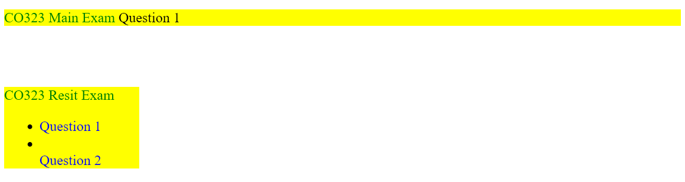
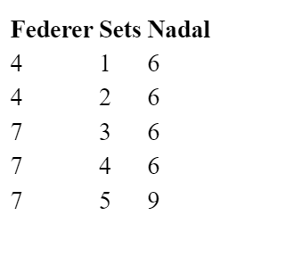

# 2023 Databases and the Web Exam

## Question 1

(1) Inspect the following HTML code

```html
<html>
<head>
<title>Good Writing Style</title>
</head>
<body>
<div style="background:yellow; width:20% height:100px;">
<p style="color:green">CO323 Main Exam
<span style="color:black">Question 1</span>
</p>
</div>
<br><br/>
<div style="background:yellow; width:20%; height:300;">
<p style="color:green">CO323 Resit Exam
<ul>
<li><span style="color:blue">Question 1<li></span>
</li><span style="color:blue">Question 2</span></li>
</ul>
</p>
</div>
</body>
</html>
```

> (a) What are the problems with the above code? Consider the syntax, structure, and writing style.

Code correctly formatted:

```html
<html>

<head>
    <title>Good Writing Style</title>
</head>

<body>
    <div style="background:yellow; width:20% height:100px;">
        <p style="color:green">CO323 Main Exam
            <span style="color:black">Question 1</span>
        </p>
    </div>
    <br><br />
    <div style="background:yellow; width:20%; height:300;">
        <p style="color:green">CO323 Resit Exam
        <ul>
            <li><span style="color:blue">Question 1
            <li></span>
            </li><span style="color:blue">Question 2</span></li>
        </ul>
        </p>
    </div>
</body>

</html>
```

Output of code:



Problems with the code:

- Using green text on a yellow background may not provide enough contrast for comfortable reading
- The `<span>` block containing Question 1 should be on another line, instead of right next to the text CO323 Main Exam
- The yellow background goes to the end of the page's width, when really it should instead have ended where the text ended
- There shouldn't be as much a space/gap between the top title, and the questions below.
- The second `<li>` item is completely blank with nothing on it.
- Question 2 doesn't appear as a list item
- The entire unordered list is wthin a `<p>` tag, when really the `<p>` tag should have ended at `CO323 Resit Exam`
- If there are going to be two different exams on a single page, it would be preferable to separate these two with a horizontal line instead of just blank space
- After width: 20%, it should have a semi-colon for the text, because otherwise the height isn't going to load properly.

> (b) Write CSS code that tidies up the above code. Your code should minimise the use of inline style.

[I don't know what it's asking here]

> (c) Add a CSS selector for all paragraphs (p elements) under div elements with class “exam” to make their background colour blue.

```css
div.exam p {
    background-color: blue;
}
```

## Question 2

> (2) Inspect the following HTML code for displaying the result of the "Wimbledon 2008 Men's Final".

```html
<html>
<head>
<title>Wimbledon 2008 Men's Final</title>
</head>
<body>
<table>
<tr id="players">
<th>Federer</th><th>Sets</th><th>Nadal</th>
</tr>
<tr id="set1"><td>4</td><td>1</td><td>6</td></tr>
<tr id="set2"><td>4</td><td>2</td><td>6</td></tr>
<tr id="set3"><td>7</td><td>3</td><td>6</td></tr>
<tr id="set4"><td>7</td><td>4</td><td>6</td></tr>
<tr id="set5"><td>7</td><td>5</td><td>9</td></tr>
</table>
<p id="result"></p>
</body>
</html>
```

>Write a JavaScript function to print "X won Y-Z in W sets" onto the HTML element with id "result", where X is the winning player, Y-Z is the score in sets, and W is the total number of sets played. Also, explain where the function should be written within the HTML structure by referring to the line number. Note that your code should work for any result displayed in this way (not only for the above result). [20 marks]

Code correctly formatted:

```html
<html>

<head>
    <title>Wimbledon 2008 Men's Final</title>
</head>

<body>
    <table>
        <tr id="players">
            <th>Federer</th>
            <th>Sets</th>
            <th>Nadal</th>
        </tr>
        <tr id="set1">
            <td>4</td>
            <td>1</td>
            <td>6</td>
        </tr>
        <tr id="set2">
            <td>4</td>
            <td>2</td>
            <td>6</td>
        </tr>
        <tr id="set3">
            <td>7</td>
            <td>3</td>
            <td>6</td>
        </tr>
        <tr id="set4">
            <td>7</td>
            <td>4</td>
            <td>6</td>
        </tr>
        <tr id="set5">
            <td>7</td>
            <td>5</td>
            <td>9</td>
        </tr>
    </table>
    <p id="result"></p>
</body>

</html>
```

Initial output of code:



Correct JavaSript code:

```JavaScript
function printResult() {
    let p1ScoreCount = 0;
    let p2ScoreCount = 0;
    let tableLength = document.getElementsByTagName("table")[0].rows.length;
    console.log(tableLength);
    for (let i = 1; i < tableLength; i++) {
        let p1Score = parseInt(document.getElementById("set" + i).getElementsByTagName("td")[0].textContent);
        let p2Score = parseInt(document.getElementById("set" + i).getElementsByTagName("td")[2].textContent);
        if (p1Score > p2Score) {
            p1ScoreCount += 1;
        } else {
            p2ScoreCount += 1;
        }
    }
    let resultHTML = document.getElementById("result");
    let p1Name = document.getElementById("players").getElementsByTagName("th")[0].textContent;
    let p2Name = document.getElementById("players").getElementsByTagName("th")[2].textContent;
    if (p1ScoreCount > p2ScoreCount) {
        resultHTML.innerHTML = p1Name + " won " + p1ScoreCount + "-" + p2ScoreCount + " in " + (tableLength - 1) + " sets.";
    } else {
        resultHTML.textContent = p1Name + " won " + p1ScoreCount + "-" + p2ScoreCount + " in " + (tableLength - 1) + " sets.";
        console.log("yeah")
    }
}
```

## Question 3

### (a) Here is the definition of a PHP function

```php
function test($arr) {
    if ($arr[1]) {
        echo "Blue";
    }
    else {
        for ($k=0; $k <= $arr[2]; $k++) {
            echo $arr[3][k];
        }
    }
}
```

Recall that array \$arr can be defined using a statement of the form:
`$arr = array(…);`

> (i) Give an array $arr such that
>
> ```php
> test($arr)
> ```
>
> would print `Blue`.

```php
$arr = array("One", true);
```

> (ii) Give an array `$arr` such that
>
> ```php
> test($arr)
> ```
>
> would print `Green`.
>
> Note: the for loop must do three iterations in case (iii).

```php
$arr = array(
    "One",
    false,
    1,
    array("Gre", "en"));
```

> (iii) Give an array `$arr` such that `test($arr)` 
>
> ```php
> test($arr)
> ```
>
> would print `Pink Purple Violet`
>
> Note: the for loop must do three iterations in case (iii).

```php
$arr = array("",false, 2, array("Pink ", "Purple ", "Violet"))
```

### (b) Consider the following code fragment in a file index.php

```php
<?php session_start();
    $_SESSION[‘name’] = ‘Alice’;
    setcookie(‘name’,‘Bob’,strtotime(“+1 month”));
?>
```

```html
<form action="next_page.php" method="post">
    <input type="text" name="trainer"> <br>
    <input type="radio" name="s1" value="Jog"> Jog <br>
    <input type="radio" name="s1" value="Sleep"> Sleep <br>
    <input type="submit">
</form>
```

Answer the following questions:

> (i) State which of the superglobal variables are certainly set in next_page.php, and which may be set or not depending on the user’s behaviour in index.php. Justify your answer.

---- come back to this---
<!-- `name` would be classed as a superglobal variable. This is because when we pass through the variable name, it is able to be passed through multiple pages, keeping its value. `trainer` is not -->

> (ii) Assume that all the superglobal variable(s) you mentioned in your answer to (i) are passed to next_page.php. Complete the code fragment below (i.e., to be included in next_page.php) so that all values of the superglobal variables are printed as a sequence of “echo” statements. Give a possible solution of printing all these variables using the sequence of echo statements you have given.
>
> ```php
> session_start();
> echo ...;
> echo ...;
> ... 
> ```

-----------------

> (iii) Is method post the best method to be used in index.php? Justify your answer.

The `POST` method may not be the best method to use for index.php. This is because if we wanted to access the same information, it would have to come with the request, and the user wouldn't be able to bookmark the page. If we used the `GET` method, it would provide a unique url, and the user would be able to bookmark the page, and return to the page.

## Question 4

A database includes information on people and clubs. Each person is identified by an integer and has their name, and phone number recorded. Each club is identified by a name and the city it is located in. The relationship between club and person is 1:N. A person must be a member of only one club. A club may include zero or more people.

> (a) Write SQL CREATE TABLE statements for the tables in the problem statement above. Justify your choices of primary and foreign keys.

Person table:

```SQL
CREATE TABLE People (
    PersonID INT PRIMARY KEY,
    FullName VARCHAR(255),
    PhoneNumber VARCHAR(20)
    ClubID INT
    FOREIGN KEY (ClubID) REFERENCES Club(ClubID),
);
```

Club table:

```SQL
CREATE TABLE Club (
    ClubID INT PRIMARY KEY,
    ClubName VARCHAR(255),
    City VARCHAR(255),
);
```

We chose the PersonID as the primary key because it's the only value that is guaranteed to be unique. This applies to ClubID also.

### (b) Write SQL statements to perform the following tasks

> (i) Insert a new person as a member of a club.

```SQL
INSERT INTO People (FullName, PhoneNumber, ClubID)
VALUES ("Steve Harvey", "+44 3322-183211", 3);
```

> (ii) Retrieve the name, phone number and club name of all people whose club is located in any city ending by “don”.

```sql
SELECT p.FullName, p.PhoneNumber, c.ClubName
FROM People p
JOIN Club c ON p.ClubID = c.ClubID
WHERE RIGHT(City, 3) = "don";
```

> (iii) Retrieve the number of members of each city (all in one query) and return only the clubs with at least 1 member.

```sql
SELECT c.City, c.ClubName, COUNT(p.PersonID) AS NumberOfMembers
FROM Club c
LEFT JOIN People p ON c.ClubID = p.ClubID
GROUP BY c.City, c.ClubName
HAVING COUNT(p.PersonID) >= 1;
```
