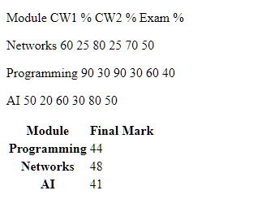

# 2023 Databases and the Web Exam

## Question 1

> (a) Inspect the following code:
>
> ```html
><html>
><head>
><title>First Attempt</title>
><style>
> td th table { border: solid 1px }
></style>
></head>
><body>
><p style="colour:green">CO323 Coursework</p>
> <table>
> <tr><th>Question<th></th>Solution</th></tr>
> <tr><td>How to calculate width?</td><td>Try
>/td></tr>
> </table>
> <caption>Notes</caption>
> </body>
> </html>
> ```
>
> Identify four problems with the above code by stating the corresponding line number and show how you fix those errors.

- Line 5: include commas between td, th, table to make sure that all are referenced.
- Line 9: Change `colour` to `color`
- Line 11: For the second table header, use an opening tag instead of a closing tag (currently, it's ```</th>Solution</th>```, but this needs to change to ```<th>Solution</th>```)
- Line 12 - After the word `Try`, change the direction of the arrow so that it is facing left instead of right (replace ```try>/td>``` with ```try</td>```)

> (b) Consider the following HTML with associated CSS:
>
> ```html
> <div id="container"><div id="inner"></div></div>
> ```
>
> ```css
> #container {
>   width: 400px;
> }
> #inner {
>   padding: 5px;
>   margin: 2px;
>   border: solid 1px grey;
>   width: calc(50% - 4px);
> }
> ```
>
> What is the entire width of the inner element, in pixels? Show your calculation.

Container width = 400px\
Total padding = 5px \* 2 = 10px\
Total margin = 1px \* 2 = 2px

(400px / 2) - 4 = 196px\
196px + 10px + 2px = 208px

> (c) Provide the complete HTML and CSS code that produces the following table:
>
> 

```html
<html>
<style>
<!-- Optional styling to make the borders 1px solid black, as well as collapsed into a single line -->
table, td {
  border-collapse: collapse;
  border: 1px solid black;
}
</style>
<body>

<table>
  <tr>
    <td></td>
    <td><b>A</b></td> <!-- Add bold text with <b> tag -->
    <td><b>B</b></td> <!-- Add bold text with <b> tag -->
  </tr>
  <tr>
    <td><b>C<b></td> <!-- Add bold text with <b> tag -->
    <td>1</td>
    <td>2</td>
  </tr>
</table>

</body>
</html>
```

## Question 2

> (2) Inspect the following HTML code for displaying the marks of a student.
>
> ```html
> <html>
> <head>
> <title>Marks</title>
> <script>
> function calculateMarks() {}
> </script>
> </head>
> <body onload="calculateMarks()">
> <div id="marks">
> <p><span>Module</span><span>CW1</span><span>%</span><span>CW2<
> /span><span>%</span><span>Exam</span><span>%</span></p>
> <p><span>Networks</span><span>60</span><span>25</span><span>80
> </span><span>25</span><span>70</span><span>50</span></p>
> <p><span>Programming</span><span>90</span><span>30</span><span
> >90</span><span>30</span><span>60</span><span>40</span></p>
> <p><span>AI</span><span>50</span><span>20</span><span>60</span
> ><span>30</span><span>80</span><span>50</span></p>
> </div>
> <table>
> <tr><th>Module</th><th>Final Mark</th></tr>
> <tr id="Programming"><th>Programming</th><td>?</td></tr>
> <tr id="Networks"><th>Networks</th><td>?</td></tr>
> <tr id="AI"><th>AI</th><td>?</td></tr>
> </table>
> </body>
> </html>
> ```
>
>Complete the JavaScript function calculateMarks() to calculate the final mark for each module, where two coursework marks and an exam mark are provided with their corresponding percentage weights. The function should then print the final marks onto the corresponding table cells (? within the `<td>` tags). The final mark of a module is the weighted average of the provided coursework and exam marks. Provide brief comments within the code to describe your solution. Note that your code should work for any number of modules displayed in this way (not only for the above three modules).
> [20 marks]

HTML Code formatted normally:

```html
<!DOCTYPE html>
<html>
<head>
    <title>Marks</title>
    <script>
        function calculateMarks() {}
    </script>
</head>
<body onload="calculateMarks()">
    <div id="marks">
        <p>
            <span>Module</span>
            <span>CW1</span>
            <span>%</span>
            <span>CW2</span>
            <span>%</span>
            <span>Exam</span>
            <span>%</span>
        </p>
        <p>
            <span>Networks</span>
            <span>60</span>
            <span>25</span>
            <span>80</span>
            <span>25</span>
            <span>70</span>
            <span>50</span>
        </p>
        <p>
            <span>Programming</span>
            <span>90</span>
            <span>30</span>
            <span>90</span>
            <span>30</span>
            <span>60</span>
            <span>40</span>
        </p>
        <p>
            <span>AI</span>
            <span>50</span>
            <span>20</span>
            <span>60</span>
            <span>30</span>
            <span>80</span>
            <span>50</span>
        </p>
    </div>
    <table>
        <tr>
            <th>Module</th>
            <th>Final Mark</th>
        </tr>
        <tr id="Programming">
            <th>Programming</th>
            <td>?</td>
        </tr>
        <tr id="Networks">
            <th>Networks</th>
            <td>?</td>
        </tr>
        <tr id="AI">
            <th>AI</th>
            <td>?</td>
        </tr>
    </table>
</body>
</html>
```

Corresponding initial output:


Correct JavaScript code, with appropriate comments:

```html
<script>
    function calculateMarks() {
        // Get all the paragraphs <p> in the marks <div>
        let paragraphs = document.getElementById("marks").getElementsByTagName("p");
        // Create an array of all the average marks for each module and set to empty
        let allAverageMarks = []
        // Loop through each paragraph module
        for (let i = 1; i < paragraphs.length; i++) {
            // Get all the spans <span> in the paragraph <p>
            let spans = paragraphs[i].getElementsByTagName("span");
            // Calculate the average mark for the module
            let averageMark = 0;
            // Loop through each <span> in the paragraph
            for (let j = 1; j < spans.length; j++) {
                // Add the mark to the average mark, and save to an integer value
                averageMark += parseInt(spans[j].innerHTML);
            }
            // Divide the average mark by the number of spans <span> to get the average mark, then save it to an integer value
            averageMark = parseInt(averageMark / spans.length);
            // Add the average mark to the allAverageMarks array
            allAverageMarks.push(averageMark);
        }
        // Grab all the table data <td> in the table <table>
        let tableData = document.getElementsByTagName("table")[0].getElementsByTagName("td");
        // Loop through each table data <td> and set the innerHTML to the average mark
        for (let i = 0; i < tableData.length; i++) {
            tableData[i].innerHTML = allAverageMarks[i];
        }
    }
</script>
```

Corresponding final output:



## Question 3

### (a) A PHP function is defined as follows

```php
function planets($arr) {
    if ($arr[1]) {
        print "Mercury";
    }
    else {
        for ($i=0; $i <= $arr[2]; $i++)
            { print $arr[3][$i];
        }
    }
    print count($arr);
}
```

Recall that array \$arr can be defined using a statement of the form:

`$arr = array(…);`

> (i) Give an array $arr such that
>
> ```php
> planets($arr)
> ```
>
> prints `Mercury`. [2 marks]

It wants to make sure that there's a value at index two. Therefore, we can simply create an array with two values like this:

```php
$arr = array("planet1", "planet2");
```

> For this case, what is the output of the instruction:
>
> ```php
> print count($arry);
> ```

The output will be: `2`

> Give an array $arr such that
>
> ```php
> planets($arr)
> ```
>
> prints `Venus`.

This works because first of all, it checks if the item at index 1 is true, which we negate by explicitly making it false. Next, it gets to index 3, and begins to go through each item in this position, therefore requiring another array. It goes through the first three items, which it prints out to the screen. Because of this, we can then simply organise the letters of `Venus` to come out in any order we'd like.

```php
$arr = array(
    0,
    false,
    2,
    array("Ven", "u", "s")
);
```

> For this case, what is the output of the instruction:
>
> ```php
> print(count($arr));
> ```

The output will be: `4`

> (iii) Give an array $arr such that
>
> ```php
> planets($arr)
> ```
>
> prints `Earth Jupiter Saturn`
>
> Note: the for loop must do three iterations in case (iii).

```php
$arr = array(
    0,
    false,
    2,
    array("Earth ", "Jupiter ", "Saturn "));
```

> (iv) For this case, what is the output of the instruction:
>
> ```php
> print count($arr);
> ```

### (b)The following is the body of a web document titled index.html

```html
<h2>Write a city:</h2>
<form action="search.php" method="POST">
    <input type="text" city="cityName" />
    <input type="submit" value="Submit" />
</form>
```

> (i) Create a drawing of what will appear on the web page when it is opened in a web browser.


> (ii) Describe what would happen after a user submits the form with the city name and write an example.

After the user inserts a city into the name into the text box and clicks submit, the browser will then send an HTTP POST request to the url specified in the action form, which here is `search.php`. The data is send over the data from within the text box, potentially allowing its contents to be used at a later date.

> (iii) Write a PHP statement in the document `search.php` to display the city submitted in (ii).

```php
<?php
// Check if the form has been submitted
if ($_SERVER["REQUEST_METHOD"] == "POST") {

    // Check if the city name is provided
    if (!empty($_POST["cityName"])) {

        // Retrieve the city name from the form data
        $cityName = $_POST["cityName"];

        // Display the submitted city name
        echo "You submitted the city: " . $cityName;
    }
}
?>
```

> (iv) Describe what would happen after a user submits the form with the city name if the method used is `GET` (replacing the `POST` method in `search.php` ) with an example.

If the user uses `GET` instead of `POST` in their HTML and PHP code, although the output onto the browser will be exactly the same, the URL for that specific website will be different. If the user inputs Paris, then the url that will be displayed will look like this:

`http://example.com/search.php?cityName=Paris`

It will have `search.php`, then `?`, then `cityName=Paris`.

## Question 4

A database is built in the library to catalogue books and handle book lending. Each book in the library is catalogued by author. Any number of books can be associated to an author. Each user is allowed to borrow one and only one book. The database stores information about the following entities and their relationships:

- User: unique reference number, name, and phone number,
- Author: unique reference number, name
- Book: unique title, category (e.g. Physics, Science,..), publication year, the user (reference) borrowing the book, the author (reference) of the book

> (a) Write SQL CREATE TABLE statements for these three tables. Justify your choices of keys used.

User Table:

```SQL
CREATE TABLE User (
    UserID INT PRIMARY KEY,
    Name VARCHAR(255),
    PhoneNumber VARCHAR(20)
);
```

`UserID`: This is chosen as the primary key for the User table because it uniquely identifies each user. It is set to be of type INT for efficiency and scalability. Additionally, it is declared as PRIMARY KEY to ensure its uniqueness and to allow for efficient indexing and retrieval of user records.

Author Table:

```SQL
CREATE TABLE Author (
    AuthorID INT PRIMARY KEY,
    Name VARCHAR(255)
);
```

`AuthorID`: This is chosen as the primary key for the Author table because it uniquely identifies each author. It is set to be of type INT for efficiency and scalability. Additionally, it is declared as PRIMARY KEY to ensure its uniqueness and to allow for efficient indexing and retrieval of author records.

Book Table:

```SQL
CREATE TABLE Book (
    BookID INT PRIMARY KEY,
    Title VARCHAR(255),
    Category VARCHAR(50),
    PublicationYear INT,
    BorrowerID INT,
    AuthorID INT,
    FOREIGN KEY (BorrowerID) REFERENCES User(UserID),
    FOREIGN KEY (AuthorID) REFERENCES Author(AuthorID)
);
```

`BookID`: This is chosen as the primary key for the Book table because it uniquely identifies each book. It is set to be of type INT for efficiency and scalability. Additionally, it is declared as PRIMARY KEY to ensure its uniqueness and to allow for efficient indexing and retrieval of book records. Although its not referenced within the details for the Book table, it has the same benefits for the primary key as mentioned for UserID and AuthorID in the User and Author tables respectively.

### (b) Write SQL statements to perform the following tasks

> (i) Insert a new entry in the user table (for a set of values at your choice).

```SQL
INSERT INTO User (Name, PhoneNumber)
VALUES ('Peter Griffin', '01227-223990');
```

> (ii) List the title for all books with author "Stephen King".

```SQL
SELECT Book.Title
FROM Book
JOIN Author ON Book.AuthorID = Author.AuthorID
WHERE Author.Name = 'Stephen King';
```

> (iii) List the names of all the authors in the database, and beside each name give the number of books published on or after 2017

```SQL
SELECT a.Name, COUNT(b.BookID) AS BooksPublishedSince2017
FROM Author a
LEFT JOIN Book b ON a.AuthorID = b.AuthorID AND b.PublicationYear >= 2017
GROUP BY a.Name;
```
