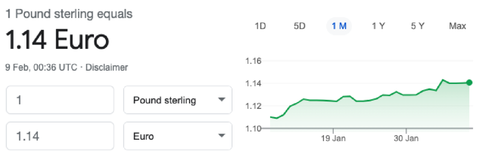

# HCI Exam 2021 - Answers to the questions

## Question 1

Heuristic Evaluation (HE) is a useful method to evaluate a computer interface. It has a standard report format and 10 Heuristics rules. Suppose you want to develop a mobile app for online Burger ordering and delivery as a UI/UX designer.

### (a)

For each of the following usability problem, use the HE Report format to list which Heuristic rule it goes against and justify the reason, give a Severity rating within a scale of 0-4 and justify the reason, and suggest a fix.

> (i) Problem 1: No progress indicator for payment processing page, which takes more than 10 sec to respond.

H1 - Visibility of system status. There is no method by which the user is updated on the progress of the payment while it's occurring, which may result in the user clicking off the browser, believing that the payment has already been achieved.

I would give this a severity rating of 2. Although it is significant enough that some users may click off the website after a while, ultimate the website, and the process overall still occurs, and this issue can be fixed potentially by adding a loading animation to indicate that the problem is being dealt with.

> (ii) Problem 2: Users are not able to input a delivery address.

H7 - Flexbility and efficiency of use. The inability for the user to insert a delivery address for a website is a major flaw in the design of the website.

I would give this a severity rating of 4, as by not being able to insert a delivery address, it makes the entire task impossible, and therefore the application or website functionally useless.

> (b) As a software development team manager, you need to fix the above 2 usability problems. Which problem(s) do you have to fix before releasing the app? Justify your answer using one sentence.

The priority would go towards problem 2, as although problem 1 may be slightly annoying, it's current status doesn't result in a broken and non-functioning application, unlike problem 2.

### c

There are a wide range of controls and widgets to choose for the user interface design. For each of the following page design, list which type of digital controls and widgets should be used.

> (i) Page 1: Users can choose one type of burger from Hamburger, Chicken burger, Veggie burger.

Radio Button

> (ii) Page 2: Users can choose one or multiple toppings from Tomato, Lettuce, Pickles, Cheese.

Checkbox

> (iii) Page 3: Users can select one type of cheese from Mozzarella, Gouda, Cheddar, Swiss cheese, Blue cheese, Brie, Monterey jack, Goat cheese.

Drop down list

## Question 2

KLM-GOMS stands for Keystroke-level model for Goals, Operators, Methods, and Selection rules. It is composed of methods that are used to achieve specific goals. In KLM-GOMS, methods are composed of operators at the lowest level. Operators might include K(key/button) =0.2 sec, P(point) = 1.1 sec, H(home) = 0.4 sec, M(mentally prepare) = 1.35 sec, R(response).

### (a) For the currency converter listed in Figure 1 below, estimate the time to for Hal to use the interface for converting 3 pounds into Euros by showing the workout apply the following steps where necessary. Assume Hal’s typing is perfect; error detection and notification are not needed. The default currency is pounds to Euro. After a number is input in the text box corresponding to pounds, the conversation is immediately displayed in the text box next to the Euro. No enter key is required to fulfill the conversation

> (i) Step 1: Operators (HPKHK) are involved to achieve the task. Justify the choice of each operator using one sentence.

HPKHK

1. H - Place the hand on the mouse
2. P - Move the mouse the upper text box
3. K - Click on the text box
4. H - Move the hand onto the correct key on the keyboard
5. K - Click the button on the keyboard

> (ii) Step 2: Apply Rule 0, add Ms in front of all Ks and Ps that point to commands.

HP**M**K**M**HK

> (iii) Step 3: Apply Rule 1, change PMK to PK to remove fully anticipated Ms.

HPK**M**HK

> (iv) Step 4: Apply Rule 2, to eliminate Ms in the middle of strings that are cognitive units.

HPK**M**HK

> (v) Step 5: Apply Rule 3, deletion of Ms before consecutive terminators.

HPK**M**HK

> (vi) Step 6: Apply Rule 4, deletion of Ms that are terminators of commands.

HPK**M**HK

> (vii) Step 7: Apply Rule 5, deletion of overlapped Ms.

HPK**M**HK

> (viii) Step 8: Calculate the time.

Time of action:

- K - (2 * 0.2) = 0.4
- P - (1 * 1.1) = 1.1
- M - (1 * 1.35) = 1.35
- H - (2 * 0.4) = 0.8

Total time = 3.65 seconds

### (b) Colour vision and perception play an important role in user interface design. Answer the following questions with one sentence

> (i) Choice of colour combination in interface design: different wavelengths of light focused on different distances behind eye’s lens, therefore colour combinations need extra care in user interface design. Which two colour’s combination would cause eye to fatigue the most; justify your answer (red and yellow, green and red, green and orange, red and blue)?

Red and blue would cause the eyes to fatigue the most. This is because these colours exist at complete opposite ends of the colour spectrum, which means that the eyes would be required to constantly adjust, leading to discomfort.

> (ii) State the consequence of an interface design with only two colours (red and green) to indicate its states.

Using the colours red and green may be unhelp for people who are colour blind, specifically those with red-green colour blindness, as they may struggle to differentiate between the colours.

> (iii) You want to create a web interface for an organic food company for online order. In order to represent the company’s ethos of linked to nature, peace, well-being, environment- friendly and freshness, which of the three colour scheme (red, blue, white, green) you should choose for the theme of the web design.

The best colours to pick for this website would be blue, white and green:

- Green for representing nature, environmental friendliness and freshness
- Blue for representing well-being
- White for repesenting cleanliness and purity

>(iv) In order to design a lo-fi interface, what is the best choice of colour for the interface.

For a very simple lo-fi design, the best choice of colours can be black and white/greyscale. This is because most lo-fi design could be created on paper with just white paper and a black pen/pencil, and no other colours.

## Question 3

Human Centred Design (HCD) Process consists of five stages: Empathise, Define, Ideate, Prototype, and Test.

### (a) For each of the following activity, match the activity to the most appropriate HCD stage as above

> (i) Activity 1: A paper model of the actual design is developed.

Prototype - The initial design has been created, but **it has not been tested on the public**.

> (ii) Activity 2: Users are asked to evaluate the design and give comments.

Test - The prototype has been created, and now it is being evaluated and **tested by the user**.

> (iii) Activity 3: Several designs approaches are discussed by development team.

Ideate - The target audience has been selected, and the problem has been defined. We are now at the stage of **discussing the design** with the team.

> (iv) Activity 4: Information collected from users is tabled in a structured form.

Define - General information (not specific to a prototype) is received, and it is the stage by which we **look at the data and analyse what to work on** in a quantitative format.

> (v) Activity 5: Users are interviewed to obtain their requirements.

Empathise - Designers try to understand the need of the users. We are starting right at the beginning, by asking users what they're thinking about.

### (b) HCD utilises many heuristics and design approaches. For each of the following scenario, give the appropriate name of the heuristic or activity. Briefly (in no more than one sentence each), explain your reasoning for giving the heuristic/activity names

> (i) Scenario 1: In a shop, there are two entry doors; one big and another small.

H1 - Visibility of System Status

- The two entry doors may communicate the status of the door. One door may be the normal door for the vast majority of customers, whereas the other door may have a more specific purpose, such as an emergency exit.

> (ii) Scenario 2: A company manager wants good quality software. The manager is willing to spend a lot of money but wants fast delivery of the completed software.

H7 - Flexibility and ease of use

- The company manager's desire for good quality software while also prioritizing fast delivery suggests a need for flexibility and  efficiency in the software development process. This heuristic emphasizes designing systems that are adaptable to user needs and allow users to accomplish tasks quickly and effectively, which aligns with the manager's goals of delivering high-quality software within a tight timeline.

> (iii) Scenario 3: In a web interface, a software developer has designed very large buttons to help the elderly click the buttons easily.

H7 - Flexibility and ease of use

- The design of large buttons in the web interface demonstrates a consideration for the needs of elderly users by making interactions more accessible and efficient.

> (iv) Scenario 4: A person tries to remember a telephone number (01634888867) by partitioning it into three parts: 01634 888 867.

H6: Recognition rather than recall.

- Partitioning the telephone number into three parts helps the person recognize and remember it more easily.

> (v) Scenario 5: Mother’s maiden name is used to retrieve passwords.

H9: Help users recognize, diagnose, and recover from errors.

- Using a familiar piece of information like a mother's maiden name as a password retrieval method helps users recognize and remember their passwords more easily.

## Question 4

For this question, you will need to design a simple interface for a microwave without any digital display. The microwave has only FIVE functions:

- START/STOP
- Microwave power mode (LOW/MED/HIGH)
- Microwave heating time for up to 30 minutes
- Open door
- Overheat warning

> (a) Sketch an interface design (with appropriate annotations on its usage) that includes approximately designed menu interface for the five functions above.

[insert image here]

> (b) For each feature that you have designed, list a design principle, and explain (in no more than one sentence each) on how the feature implements the principle.

[insert features here]
