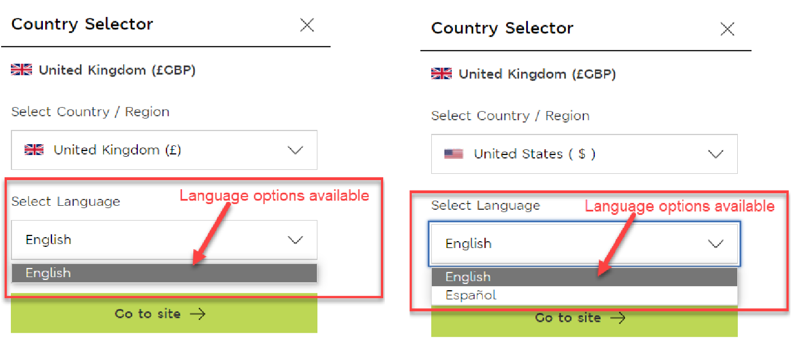

# HCI Exam 2022 - Answers to the questions

## Question 1

Human Centred Design (HCD) Process consists of five stages: Empathise, Define, Ideate, Prototype, and Test

### a

For each of the following activity, match the activity to the most appropriate HCD stage as above.

> (i) Activity 1: Peter Opsvik noticed his three-year old son Thor – too big for a high chair but too small for an adult chair – struggled for a place at the family dining table.

Empathise stage - We already know who we are designing for (a child), and we have **passed the empathise stage**. We are now attempting to understand their problem, defining their needs based on current observatiosn.

> (ii) Activity 2: A user is shown an interface prototype by a facilitator and asked to do Heuristic Evaluation for the interface design

Test stage - The prototype has been created, and now we are handing over our prototype to a variety of users in order to review it. We are **in the final** stage before the release of the product.

> (iii) Activity 3: Team brainstorms 5 different approaches to develop an interface for an online printing service

Ideate stage - We have defined the problem, and are now attempting to brainstorm a variety of different ideas **before** we begin to produce prototypes.

> (iv) Activity 4: Use Matrix Analysis method to help you to manage and synthesise data into information gathered from notes, video, surveys.

Define stage - Information is collected from a variety of sources of all different demographics, perhaps getting their opinion on a variety of topics. Once the data has been thoroughly analysed, then we can look into the data that's been collected, and attempt to **define the issues** that people may be having through a quantitative analysis.

> (v) Activity 5: Wireframing tool is used to produce version 2 of an interface for an online food delivery mobile application.

Prototype stage - We have brainstormed our ideas, and have now created a prototype of the interface. The fact that it's version 2 suggests that a version 1 interface was previously created, and we've **returned to the prototyping stage** in order to create the next version.

### b

In HCD, there are many design concepts. For each of the following scenario, give the appropriate name of the design concept. Briefly (in no more than one sentence each), explain how the design concept can be used in HCI.

> (i) Scenario 1: Although not required, mouse has a clicking sound when pressed.

Affordance - the clicking sound when pressing the mouse provides auditory feedback which suggests the action of clicking, helping to reinforce the user's actions.

> (ii) Scenario 2: Facebook shows random friends’ updates.

Visibility - The user is easily able to see the updates on their feed, ensuring that this information is accessible and easily interactived by the user.

> (iii) Scenario 3: When designing a mobile application, wireframing tool is used to limit the size of the screen to simulate different sizes of mobile phones available on the market.

Constraints - By limiting the number of interactions on the screen, this helps to guide the user to towards desired outcomes and behaviours. A smaller screen may present the user with fewer options, which may be required to allow the application's layout and features to remain consistent across different devices.

> (iv) Scenario 4: Unhealthy food and drinks are placed to the bottom of a shelf in a supermarket to encourage people consume more healthy food.

Mapping - Mapping refers to the relationship between control and effect. In this example, by placing the unhealthy food and drinks towards the bottom of the shelf, this may map to the desired behaviour of encouraging people to consume healthier food, as the healthier food will be mor easily accessible and visible at eye level.

> (v) Scenario 5: Speak to a group of elderly people to decide the font size for a mobile application designed for these people.

Feedback - By speaking to your potential user base, you can gather feedback and information that will be useful when creating prototypes, as well as the final product.

## Question 2

Below shows a form provided on a website for the user to choose the delivery country, the currency the prices on the website are displayed in, and the language the website content is displayed in. This question focuses on the language selection functionality.

To select their preferred language, the user first selects a country and then the language options are displayed, see figure 1 below.
The language choices available to the user when they change their country to United Kingdom, United States, or Canada are provided below.

- If the user selects “United Kingdom”, they have only one language option – English.
- If the user selects “United States”, they have two language options – English and Español.
- If the user selects “Canada”, they have two language options – English and Français.

With reference to the scenario above, answer the following questions:

> (a) Identify two potential usability problems with the language selection functionality provided by the interface.

- The first usability problem may be the limited number of languages available. If the website is only available in both English and Spanish, then it may limit people who do not speak these languages.
- The second usability problem that may arise out of the design is that the text above the language selection input box, which reads "Select Language", is written in English. Somebody who is not a native English speaker may not understand what this text means, and may therefore struggle to use the application. This could be solved by placing a picture of a globe next to the text; the globe being a universally known symbol to indicate different countries and languages.
- A third usability issue is the fact that the text box for language selection and the background of the website are the same colour, which may result in some users with restricted vision struggling to see that the text box is in fact able to be selected.

> (b) KLM-GOMS stands for Keystroke-Level Model for Goals, Operators, Methods, and Selection rules. It allows designers to predict how long it will take a skilled user to execute a specific set of actions using a particular interface design. The standard set of operators are:

- Keying (K): for typing a key or clicking a control – 0.2s
- Pointing (P): pointing with a mouse to a target on a display – 1.1s
- Homing (H): home hands on keyboard or other input device – 0.4s
- Mentally Preparing (M): think before doing an action – 1.35s
- Responding (R): time a user must wait for a response

Once you determine the operators, you need to apply the following rules for mental operations before calculating the time.

- Rule 0: Add Ms in front of all Ks and all Ps that point to commands.
- Rule 1: Change PMK to PK to remove fully anticipated Ms.
- Rule 2: Eliminate any Ms in the middle of strings that are part of a cognitive unit (a contiguous sequence of typed characters).
- Rule 3: Delete Ms before consecutive terminators.
- Rule 4: Delete Ms that are terminators of commands.
- Rule 5: Delete overlapped Ms, i.e., overlaps an R (a delay).

> (i) Using KLM-GOMS, list out the necessary actions and identify the operators that will be used to calculate the time required to take a skilled user to change their preferred country using the interface shown in figure 1 Assume that the currently displayed country is the “United Kingdom”, and the user needs to select “United States” from the country/region dropdown and choose “Español” from the language dropdown. Assume no scrolling is involved in either dropdown control. Clicking the “Go to site” button at the end will apply the change.

My steps:

Original steps:

1. R - Wait for website to load
2. M - Think about changing country and find it on the screen
3. H - Place hands on the mouse and keyboard
4. P - Move the cursor to the selection
5. K - Click on the selection
6. R - Wait for the selection to change
7. M - Think about the country, and find it within the selection
8. P - Move the cursor to the specific country (United States)
9. K - Click on the country
10. R - Wait for the drop down menu to disappear
11. M - Find the language selection on the screen
12. P - Move the mouse cursor to the language selection
13. K - Click on the box
14. M - Find the specific language (Spanish)
15. P - Move the mouse cursor to the specific language
16. K - Click on the language
17. R - Wait for the menu to disappear.
18. M - Find the "Go to site" button
19. P - Move the mouse to the button
20. K - Click on the button

Steps before rules: RMHPKRMPKRMPKMPKRMPK

Steps with rules:

1. R - Wait for website to load
2. M - Think about changing country and find it on the screen
3. H - Place hands on the mouse and keyboard
4. P - Move the cursor to the selection
5. K - Click on the selection
6. **M - Added M**
7. R - Wait for the selection to change
8. M - Think about the country, and find it within the selection
9. P - Move the cursor to the specific country
10. K - Click on the country
11. **M - Added M**
12. R - Wait for the drop down menu to disappear
13. M - Find the language selection on the screen
14. P - Move the mouse cursor to the language selection
15. K - Click on the box
16. **M - Added M**
17. M - Find the specific language (Spanish)
18. P - Move the mouse cursor to the specific language
19. K - Click on the language
20. **M - Added M**
21. R - Wait for the menu to disappear.
22. M - Find the "Go to site" button
23. P - Move the mouse to the button
24. K - Click on the button

Final result: RMHPKMRMPKMRMPKMMPKMRMPK

> (ii) Using your solution from (i), apply the rules for mental operations where applicable and use your final formula to make a prediction of the time it will take a skilled user to complete the task.

Time of the action:

- M (9 * 1.35) = 12.15
- K (5 * 0.2) = 1
- P (5 * 1.1) = 5.5
- H (1 * 0.4) 0.4

Total time: 19.05 seconds

## Question 3

For this question, you will need to design a simple interface for a microwave without any digital display. The microwave has only FIVE functions:

- START/STOP
- Microwave power mode (LOW/MED/HIGH)
- Microwave heating time for up to 30 minutes
- Open door
- Overheat warning

> (a) Sketch an interface design (with appropriate annotations on its usage) that includes approximately designed menu interface for the five functions above.

[insert image here]

> (b) For each feature that you have designed, list a design principle, and explain (in no more than one sentence each) on how the feature implements the principle.

[insert features here]
