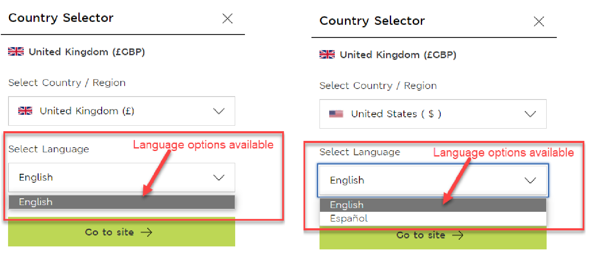

# HCI Exam 2022 - Answers to the questions

## Question 1

Human Centred Design (HCD) Process consists of five stages: Empathise, Define, Ideate, Prototype, and Test

### a

For each of the following activity, match the activity to the most appropriate HCD stage as above.

> (i) Activity 1: Peter Opsvik noticed his three-year old son Thor – too big for a high chair but too small for an adult chair – struggled for a place at the family dining table.

[fill in answer]

> (ii) Activity 2: A user is shown an interface prototype by a facilitator and asked to do Heuristic Evaluation for the interface design

[fill in answer]

> (iii) Activity 3: Team brainstorms 5 different approaches to develop an interface for an online printing service

[fill in answer]

> (iv) Activity 4: Use Matrix Analysis method to help you to manage and synthesise data into information gathered from notes, video, surveys.

[fill in answer]

> (v) Activity 5: Wireframing tool is used to produce version 2 of an interface for an online food delivery mobile application.

[fill in answer]

### b

In HCD, there are many design concepts. For each of the following scenario, give the appropriate name of the design concept. Briefly (in no more than one sentence each), explain how the design concept can be used in HCI.

> (i) Scenario 1: Although not required, mouse has a clicking sound when pressed.

[fill in answer]

> (ii) Scenario 2: Facebook shows random friends’ updates.

[fill in answer]

> (iii) Scenario 3: When designing a mobile application, wireframing tool is used to limit the size of the screen to simulate different sizes of mobile phones available on the market.

[fill in answer]

> (iv) Scenario 4: Unhealthy food and drinks are placed to the bottom of a shelf in a supermarket to encourage people consume more healthy food.

[fill in answer]

> (v) Scenario 5: Speak to a group of elderly people to decide the font size for a mobile application designed for these people.

[fill in answer]

## Question 2

Below shows a form provided on a website for the user to choose the delivery country, the currency the prices on the website are displayed in, and the language the website content is displayed in. This question focuses on the language selection functionality.

To select their preferred language, the user first selects a country and then the language options are displayed, see figure 1 below.
The language choices available to the user when they change their country to United Kingdom, United States, or Canada are provided below.

- If the user selects “United Kingdom”, they have only one language option – English.
- If the user selects “United States”, they have two language options – English and Español.
- If the user selects “Canada”, they have two language options – English and Français.

With reference to the scenario above, answer the following questions:

> (a) Identify two potential usability problems with the language selection functionality provided by the interface.

[fill in answer]

> (b) KLM-GOMS stands for Keystroke-Level Model for Goals, Operators, Methods, and Selection rules. It allows designers to predict how long it will take a skilled user to execute a specific set of actions using a particular interface design. The standard set of operators are:

- Keying (K): for typing a key or clicking a control – 0.2s
- Pointing (P): pointing with a mouse to a target on a display – 1.1s
- Homing (H): home hands on keyboard or other input device – 0.4s
- Mentally Preparing (M): think before doing an action – 1.35s
- Responding (R): time a user must wait for a response

Once you determine the operators, you need to apply the following rules for mental operations before calculating the time.

- Rule 0: Add Ms in front of all Ks and all Ps that point to commands.
- Rule 1: Change PMK to PK to remove fully anticipated Ms.
- Rule 2: Eliminate any Ms in the middle of strings that are part of a cognitive unit (a contiguous sequence of typed characters).
- Rule 3: Delete Ms before consecutive terminators.
- Rule 4: Delete Ms that are terminators of commands.
- Rule 5: Delete overlapped Ms, i.e., overlaps an R (a delay).

> (i) Using KLM-GOMS, list out the necessary actions and identify the operators that will be used to calculate the time required to take a skilled user to change their preferred country using the interface shown in figure 1 Assume that the currently displayed country is the “United Kingdom”, and the user needs to select “United States” from the country/region dropdown and choose “Español” from the language dropdown. Assume no scrolling is involved in either dropdown control. Clicking the “Go to site” button at the end will apply the change.

[fill in answer]

> (ii) Using your solution from (i), apply the rules for mental operations where applicable and use your final formula to make a prediction of the time it will take a skilled user to complete the task.

[fill in answer]

## Question 3

For this question, you will need to design a simple interface for a microwave without any digital display. The microwave has only FIVE functions:

- START/STOP
- Microwave power mode (LOW/MED/HIGH)
- Microwave heating time for up to 30 minutes
- Open door
- Overheat warning

> (a) Sketch an interface design (with appropriate annotations on its usage) that includes approximately designed menu interface for the five functions above.

[insert image here]

> (b) For each feature that you have designed, list a design principle, and explain (in no more than one sentence each) on how the feature implements the principle.

[insert features here]
